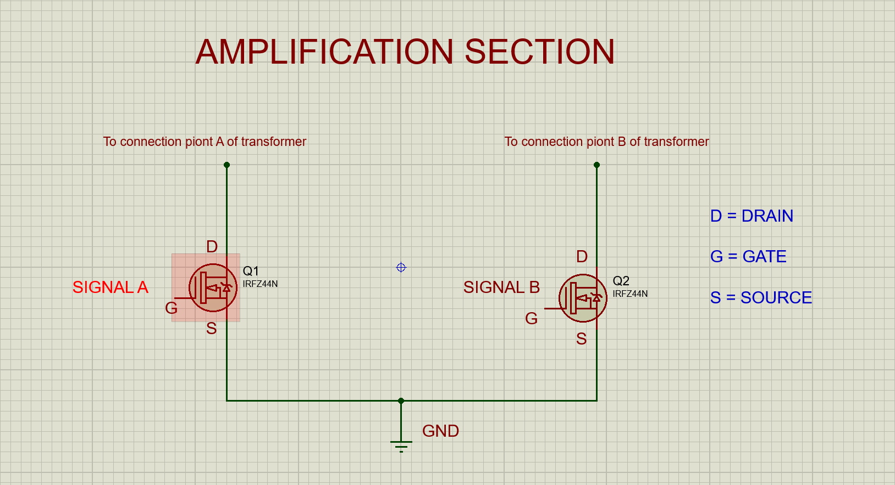
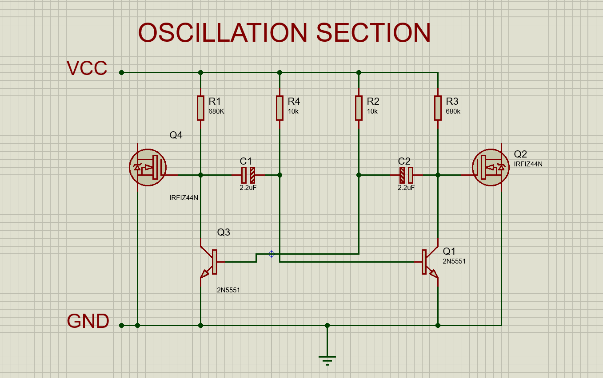

## Amplification Section

The signal from the oscillation section has limited power and cannot directly drive a load. The amplification section uses MOSFETs (IRFZ44N) to amplify the signal’s current and voltage, making it suitable for powering larger devices.

<em text-align="center" >Schematic of the amplification section</em>

### Step-by-Step Wiring

1. Install MOSFETs:
    + Place the two IRFZ44N MOSFETs on the breadboard. Connect their gates to the two signals A and B of the oscillation section.
2. Connect the Drains:
    + Attach the drains of the MOSFETs to the primary coil of the step-up transformer.
3. Ground the Sources:
    + Connect the sources of the MOSFETs to the GND rail.

<em text-align="center" >Schematic diagram showing the oscillation combined with the amplification section</em>

### Output
A high-current square wave signal at 50 to 60 Hz.

 Next Step: >> [Transformation](/transformation.md)
