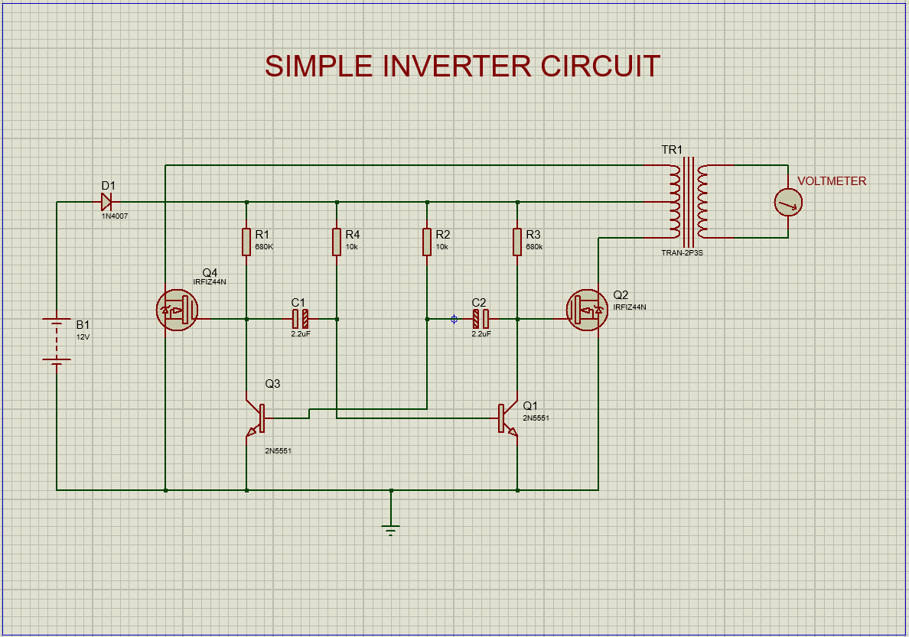

## Complete Circuit Assembly

<em text-align="center" >Schematic of complete solar inverter</em>

### Step-by-Step Instructions

1. Assemble Oscillation Section: Follow the detailed instructions to create the oscillation circuit.
2. Connect Amplification Section: Wire the MOSFETs to amplify the signal.
3. Add Step-Up Transformer: Complete the circuit by connecting the transformer for voltage conversion.
4. Test and Verify: Ensure proper operation before using the inverter with appliances