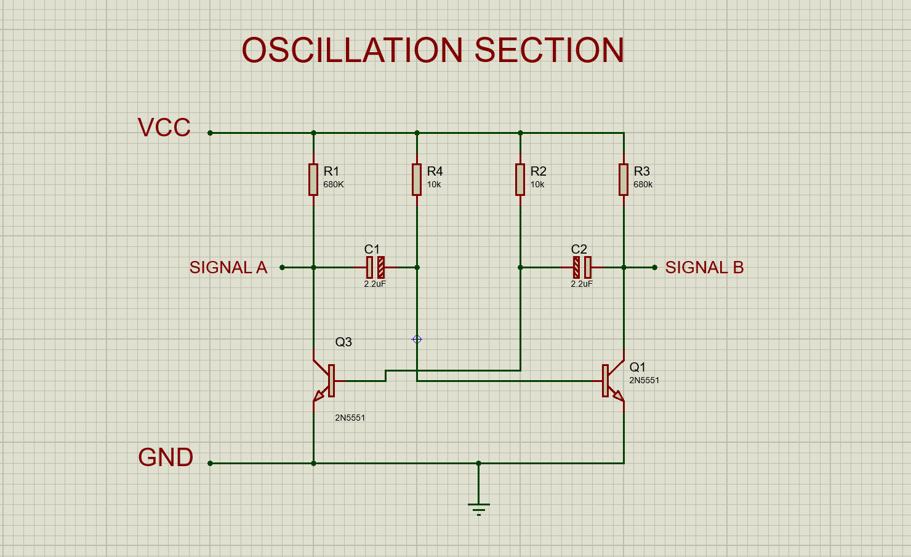

## Oscillation Section

The oscillation section generates a square wave AC signal with a frequency of 50 Hz to 60 Hz, closely replicating the characteristics of household electricity. This is achieved using an astable multivibrator circuit, a fundamental electronic design for producing oscillations.

<em text-align="center" >Schematic of the oscillation section</em>

### Step-by-Step Wiring

1. Install Resistors:
    + Attach resistor R4 and R2 from the negative terminal of each capacitor C1 and C2 respectively to the VCC rail. This resistor ensures proper biasing of the transistors.
    + Connect resistor R1 and R3 to each positive terminal of the capacitor C1 and C2 respectively as shown in the circuit diagram above to limit current flow to the transistor bases.
2. Place the Transistors:
    + Insert the two 2N5551 transistors onto the breadboard Position them with sufficient space to connect components.
    + Connect collector of each transistor Q1 and Q3 to the positive of capacitors C2 and C1 respectively.
    + Then Connect the base of the transistor Q3 to the negative terminal of Capacitor C2 and the base of Transistor Q1 to the negative terminal of capacitor C1
    + Connect the emitters of both transistors Q1 and Q3 to the GND rail.
    + Tap Signal A from the junction of R1,C1,Q3 and Signal B from junction R3,C2,Q1