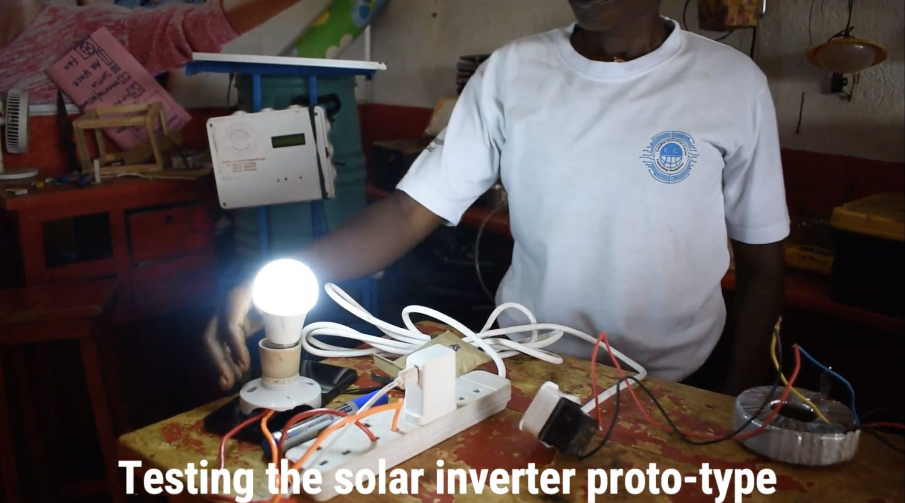

## Testing, Application and Safety Notes

### Testing and Operation
1. Power Supply:
    + Use a stable 12 V DC source such as a solar panel or battery.
2. Measure Voltage:
    + Use a multimeter to ensure the transformer’s secondary coil outputs 220 V AC.
3. Load Testing:
    + Connect a small AC appliance to verify proper operation.

<em text-align="center" >Testing the solar inverter by converting the DC voltage to AC voltage using a light bulb to demonstrate.</em>

### Applications

+ Emergency backup power.
+ Powering small appliances with solar energy.
+ Educational demonstrations of inverter design.

### Safety Notes

+ Handle high voltage with caution.
+ Ensure all components are rated for the intended load.
+ Disconnect the circuit during modifications.