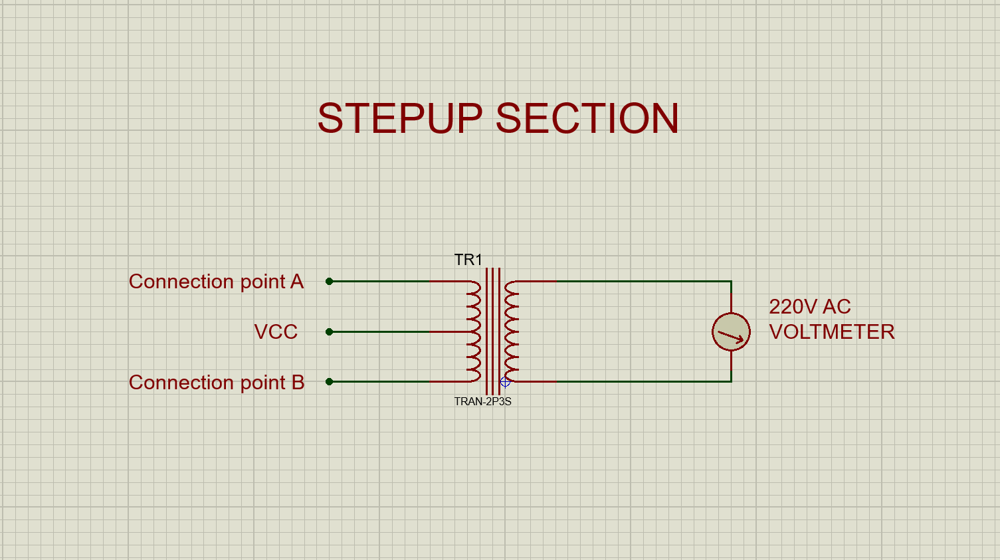

## Step-Up Transformation

This section converts the low-voltage AC signal (12 V) into high-voltage AC (220 V) using a step-up transformer.

<em text-align="center" >Schematic of the step-up section</em>

### Step-by-Step Wiring

1. Primary Coil Wiring:
    + Attach the ends of the primary coil (Connection point A and Connection Point B) to the MOSFET drains from the amplification section and the Centre tap to the VCC Rail.
2. Final Checks:
    + Verify all connections before powering the circuit to prevent damage.
    
### Output
Produces 220 V AC at 50 to 60 Hz, suitable for household appliances.

 Next Step: >> [Assembly the complete circuit](/circuit_assembly.md)
